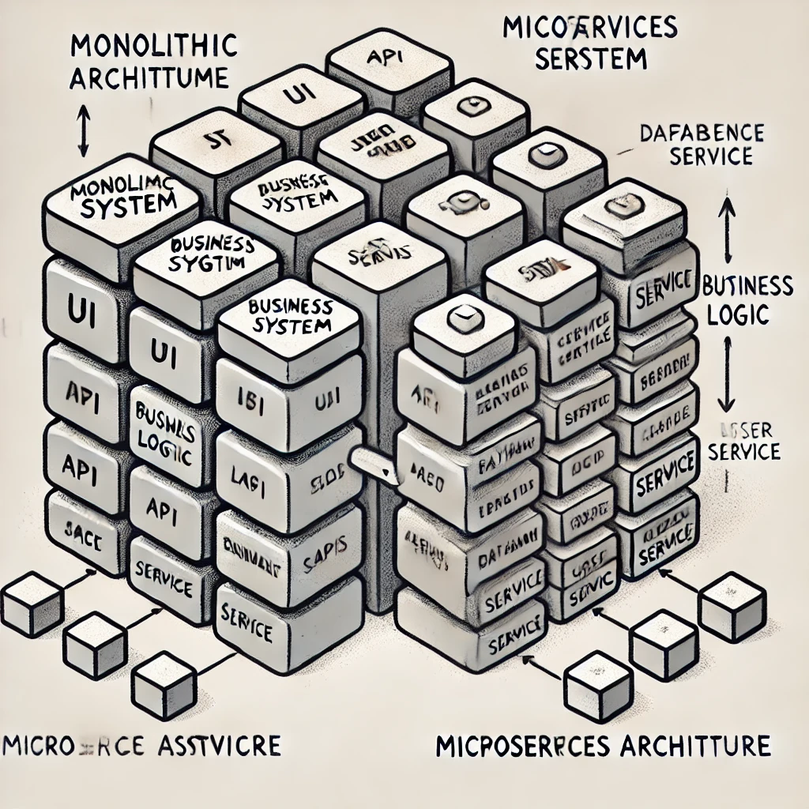

# **Monolithic Web Service vs. Microservices

## **1. Monolithic Web Service (Monolithic Architecture)**  
A **Monolithic web service** follows a **monolithic architecture**, where the entire application (frontend, backend, and database) is built as a **single unit**.  

- **All features (UI, logic, database) are tightly connected.**  
- If one part of the system needs an update, the entire application must be redeployed.  
- Often used for **small to medium-sized** applications.  

**Example:** A traditional e-commerce website where product listing, cart, and payment are all in one large codebase.

---

## **2. Microservices Architecture**  
A **microservices architecture** splits an application into **independent, smaller services** that work together. Each service handles a specific task (e.g., authentication, payments, product management).  

- **Each service runs separately and communicates via APIs.**  
- Easier to scale and update individual parts without affecting the entire system.  
- Often used for **large, complex** applications.  

**Example:** Amazon or Netflix, where different teams manage independent services (video streaming, payments, recommendations).  

---

## **Comparison: Monolithic vs. Microservices**  

| Feature            |  Monolithic  | Microservices  |
|--------------------|-----------------------|---------------|
| **Structure**      | Single codebase       | Multiple small services |
| **Scalability**    | Hard to scale specific parts | Easy to scale individual services |
| **Development**    | One team works on everything | Different teams work on different services |
| **Deployment**     | Whole application redeployed | Deploy services independently |
| **Flexibility**    | Limited flexibility | Choose different technologies for each service |
| **Performance**    | Can become slow as it grows | Optimized by scaling only necessary parts |
| **Maintenance**    | Harder to update without breaking things | Easier to maintain & update |
| **Best for**       | Small to medium projects | Large, complex applications |

---

## **Which One to Choose?**  
- **Use Monolithic if**: You are building a small web app with simple features.  
- **Use Microservices if**: You need high scalability, flexibility, and faster updates for a large system.  

**Think of Monolithic as a one-story house** (simple, all connected) vs. **Microservices as an apartment building** (each unit operates independently).